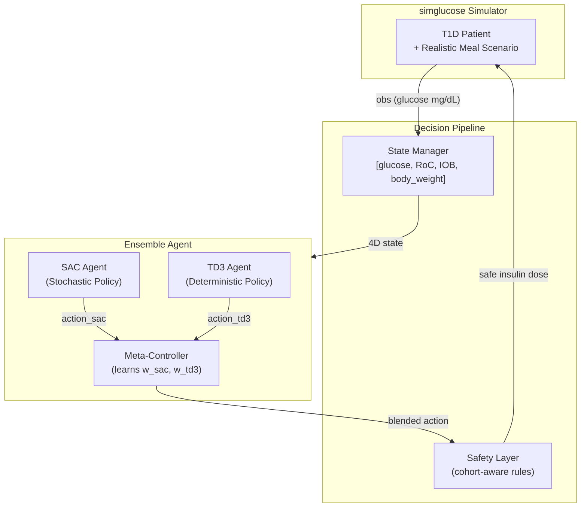
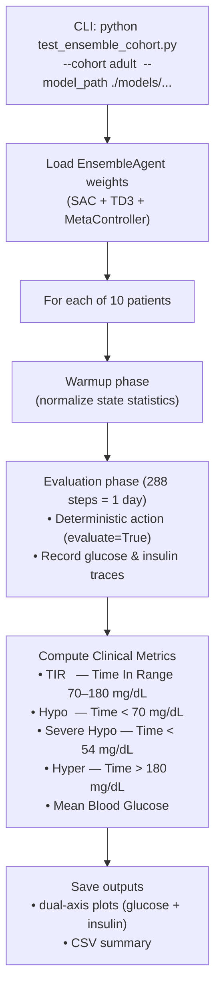
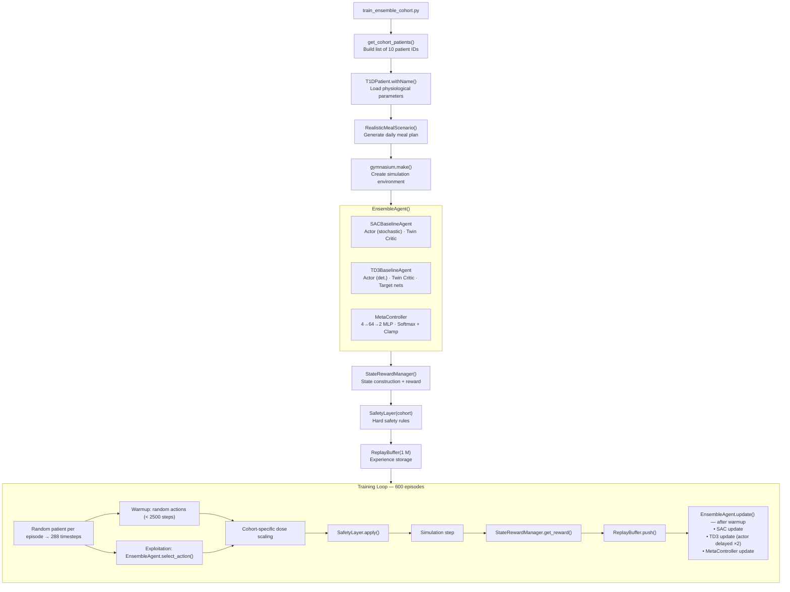
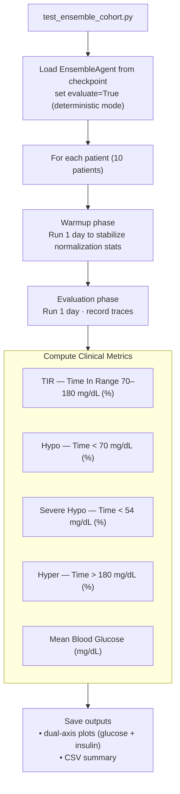

# Personalized Diabetes Management using Reinforcement Learning

> Extension work from MINI02 to MAJOR Project — A fully closed-loop Artificial Pancreas (AP) system powered by a Trainable Ensemble Reinforcement Learning agent.

---

## Table of Contents

1. [Project Overview](#project-overview)
2. [System Architecture](#system-architecture)
3. [Overall Workflow Diagram](#overall-workflow-diagram)
4. [Component Details](#component-details)
   - [Environment & Simulation](#environment--simulation)
   - [State Representation](#state-representation)
   - [Ensemble Agent (Meta-Controller)](#ensemble-agent-meta-controller)
   - [Reward Function](#reward-function)
   - [Safety Layer](#safety-layer)
   - [Replay Buffer](#replay-buffer)
5. [Training Pipeline](#training-pipeline)
6. [Evaluation Pipeline](#evaluation-pipeline)
7. [Project Structure](#project-structure)
8. [Installation & Requirements](#installation--requirements)
9. [Usage](#usage)
10. [Clinical Metrics](#clinical-metrics)
11. [Training Results](#training-results)

---

## Project Overview

This project implements a **Personalized Closed-Loop Artificial Pancreas** system for Type 1 Diabetes (T1D) management. The system uses **Reinforcement Learning (RL)** to learn optimal continuous insulin dosing strategies for different patient cohorts (children, adolescents, adults) without relying on meal announcements.

**Key innovation:** A **Trainable Ensemble Agent** that dynamically combines the strengths of two RL algorithms — **SAC (Soft Actor-Critic)** and **TD3 (Twin Delayed Deep Deterministic Policy Gradient)** — via a learned **Meta-Controller**, resulting in more robust and personalized insulin dosing.

---

## System Architecture



---

## Overall Workflow Diagram

### Training Workflow (`train_ensemble_cohort.py`)

```mermaid
flowchart TD
    CLI["CLI: python train_ensemble_cohort.py\n--cohort child|adolescent|adult  --seed 42"]

    S1["STEP 1 — SETUP\n• Detect device (CUDA / CPU)\n• Set random seeds\n• Hyperparams: 600 eps · 288 steps/ep\n  batch=256 · buffer=1M · warmup=2500"]

    S2["STEP 2 — ENV INIT (10 patients)\nFor each patient:\n  • Load T1DPatient physiological params\n  • Create RealisticMealScenario (6 meals/day)\n  • Register Gymnasium env (simglucose)\n  • Store env & body weight"]

    S3["STEP 3 — COMPONENTS\n• EnsembleAgent(state_dim=4, action_dim=1)\n  – SACBaselineAgent  (stochastic)\n  – TD3BaselineAgent  (deterministic)\n  – MetaController    (64-unit MLP)\n• StateRewardManager\n• SafetyLayer(cohort)\n• ReplayBuffer(1 M)"]

    S4_EP["Per Episode (600 total)\n1. Sample random patient\n2. Reset env & StateRewardManager\n3. Build 4D state [glucose, RoC, IOB, BW]\n4. Online-normalize state"]

    S4_TS["Per Timestep (288 = 24 h)\nif steps < 2500 → random action\nelse → EnsembleAgent.select_action(state)\n  • SAC stochastic action\n  • TD3 deterministic + noise\n  • Meta-Controller blend:\n    a_ens = w_sac·a_sac + w_td3·a_td3\n\nDose scaling (cohort-specific)\n  Adult:       dose = norm_action × 2.0  (linear)\n  Adolescent:  dose = norm_action² × 0.75\n  Child:       dose = norm_action² × 0.30\nSafetyLayer.apply()\nSim step → next obs\nReplayBuffer.push()\nEnsembleAgent.update() (after warmup)\n  • SAC update\n  • TD3 update (actor delayed ×2)\n  • MetaController: meta_loss = -min(Q)"]

    CKP["Checkpointing\n• best_model.pth  (rolling-10 avg improves)\n• model_final.pth (ep 600)"]

    CLI --> S1 --> S2 --> S3 --> S4_EP --> S4_TS --> CKP
```



### Evaluation Workflow (`test_ensemble_cohort.py`)



---

## Component Details

### Environment & Simulation

| Component | Description |
|-----------|-------------|
| **Simulator** | `simglucose` — FDA-accepted UVA/Padova T1D simulator |
| **Patient Cohorts** | 10 adults, 10 adolescents, 10 children (30 virtual patients total) |
| **Simulation step** | 5 minutes per timestep; 288 steps = 24 hours |
| **Meal Scenario** | `RealisticMealScenario` — probabilistic 6-meal-per-day generator (breakfast, mid-morning snack, lunch, afternoon snack, dinner, evening snack). Meal timing follows truncated-normal distributions; meal size scales with patient body weight. Based on Wang et al. (Biomedicines 2024). |
| **Closed-loop** | No meal announcements to agent — fully autonomous AP mode |

### State Representation

The agent observes a **4-dimensional state vector** at each timestep:

| Dimension | Variable | Description |
|-----------|----------|-------------|
| 1 | `glucose` | Current blood glucose (mg/dL) |
| 2 | `rate_of_change` | Glucose velocity (mg/dL/min), computed over last 5 min |
| 3 | `IOB` | Insulin On Board — active insulin computed via PK/PD gamma curve (peak at 55 min) |
| 4 | `body_weight` | Patient body weight (kg) — personalizes dosing scale |

States are **online-normalized** using a running mean/std (Welford's algorithm) updated every timestep.

### Ensemble Agent (Meta-Controller)


<!--
```
              ┌──────────────────────────────────────┐
 4D State ───►│         EnsembleAgent                │
              │                                      │
              │  ┌─────────────┐  ┌───────────────┐  │
              │  │ SAC Actor   │  │  TD3 Actor    │  │
              │  │ (stochastic)│  │(deterministic)│  │
              │  └──────┬──────┘  └───────┬───────┘  │
              │   a_sac │           a_td3 │           │
              │         └────────┬────────┘           │
              │                  │                    │
              │  ┌───────────────▼──────────────────┐ │
              │  │      MetaController               │ │
              │  │  Linear(4→64) → ReLU              │ │
              │  │  Linear(64→2) → Softmax → Clamp   │ │
              │  │  weights ∈ [0.2, 0.8]             │ │
              │  └───────────────┬──────────────────┘ │
              │            [w_sac, w_td3]              │
              │                  │                    │
              │   a_ens = w_sac·a_sac + w_td3·a_td3   │
              └──────────────────┬───────────────────┘
                                 │
                           final action
```
-->

**Meta-Controller Training:**
- Loss: `meta_loss = -mean(min(Q1, Q2)(state, a_ens))`
- Maximizes expected Q-value of the blended action
- Weight clamping to `[0.2, 0.8]` prevents degenerate single-agent collapse

### Reward Function

The reward function uses a **9-component multi-zone shaping** design:

| Component | Description |
|-----------|-------------|
| 1. Primary Gaussian | Peak reward at 110 mg/dL (σ=25), bonus for 90–130 range |
| 2. Extended Zone | Moderate reward for 70–180 mg/dL (σ=40) |
| 3. Hypoglycemia Penalty | Severe: –500× at <54; Strong: –250× at <70 |
| 4. Hyperglycemia Penalty | Progressive: gentle at >140, strong at >250 |
| 5. Stability Bonus | +15 for |RoC| < 1.5 in range; –15 for |RoC| > 3.0 |
| 6. Trend Reward | Bonus for moving toward 110 mg/dL |
| 7. IOB Management | Penalty for IOB > 10 U; severe penalty for IOB > 15 U |
| 8. Consistency Bonus | +20 if last 5 steps all in good zones |
| 9. Recovery Bonus | +50 for recovery from hypo; +30 from hyper |

Final reward is clipped to `[-500, 100]` for training stability.

### Safety Layer

Cohort-aware hard-safety rules applied **after** the agent's action:

| Rule | Trigger | Action |
|------|---------|--------|
| Hard Hypo Cutoff | glucose < 80 mg/dL | Dose = 0 |
| Predictive Suspension | predicted BG in 20 min < 75 mg/dL | Dose = 0 |
| IOB Stack Cutoff | IOB ≥ max_safe_iob | Dose = 0 |
| Gentle Brakes | rate_of_change < -1.5 mg/dL/min | Dose × 0.5 |

**Cohort-specific IOB limits:**

| Cohort | Max Safe IOB |
|--------|-------------|
| Child | 1.0 U |
| Adolescent | 2.0 U |
| Adult | 6.0 U |

### Replay Buffer

- Capacity: **1,000,000** transitions
- Stores: `(state, action, reward, next_state, done)` tuples
- Sampling: uniform random sampling
- Shared across all patients in the cohort within one training run

---

## Training Pipeline



---

## Evaluation Pipeline



---

## Project Structure

```
.
├── train_ensemble_cohort.py      # Main: train Trainable Ensemble agent
├── train_cohort.py               # Train individual SAC or TD3 baseline agent
├── test_ensemble_cohort.py       # Evaluate ensemble model on cohort
├── test_cohort.py                # Evaluate baseline model on cohort
├── test_trainable_ensemble.py    # Additional ensemble evaluation script
├── check_gpu.py                  # GPU availability check
│
├── agents/
│   ├── ensemble_agent.py         # EnsembleAgent + MetaController
│   ├── sac_baseline.py           # SAC Actor, Twin Critic, update logic
│   └── td3_baseline.py           # TD3 Actor, Twin Critic, delayed update
│
├── utils/
│   ├── replay_buffer.py          # Experience replay (deque-based)
│   ├── realistic_scenario.py     # Probabilistic meal scenario generator
│   ├── safety2_closed_loop.py    # Cohort-aware safety layer
│   └── state_management_closed_loop_ensemble.py  # State + reward manager
│
├── simglucose/                   # UVA/Padova T1D simulation engine
│   └── ...
│
├── models/                       # Saved model checkpoints (auto-created)
│   └── trainable_ensemble_<cohort>/
│       ├── best_model.pth
│       └── model_final.pth
│
├── results/                      # Evaluation plots and CSVs (auto-created)
│   └── eval_ensemble_<cohort>/
│       ├── plot_<patient>.png
│       └── ensemble_evaluation_summary.csv
│
├── logs/                         # Training logs
├── requirements_j.txt            # Python dependencies
└── README.md                     # This file
```

---

## Installation & Requirements

**Python 3.8+** is required.

Key dependencies:

| Package | Version | Purpose |
|---------|---------|---------|
| `torch` | 2.7.1 | Deep learning framework |
| `gymnasium` | 0.29.1 | RL environment interface |
| `simglucose` | 0.2.11 | T1D glucose simulation |
| `numpy` | 2.2.6 | Numerical computing |
| `scipy` | 1.15.3 | PK/PD curve computation |
| `pandas` | 2.3.1 | Results export |
| `matplotlib` | 3.10.3 | Evaluation plots |

Install dependencies:

```bash
pip install -r requirements_j.txt
```

---

## Usage

### Train the Ensemble Agent

```bash
# Train on the adult cohort
python train_ensemble_cohort.py --cohort adult --seed 42

# Train on the adolescent cohort
python train_ensemble_cohort.py --cohort adolescent --seed 42

# Train on the child cohort
python train_ensemble_cohort.py --cohort child --seed 42
```

### Train Baseline Agents (SAC or TD3)

```bash
# Train SAC on adult cohort
python train_cohort.py --agent sac --cohort adult --seed 42

# Train TD3 on adolescent cohort
python train_cohort.py --agent td3 --cohort adolescent --seed 42
```

### Evaluate the Ensemble Model

```bash
python test_ensemble_cohort.py \
    --cohort adult \
    --model_path ./models/trainable_ensemble_adult/best_model.pth \
    --seed 100
```

Output is saved to `./results/eval_ensemble_<cohort>/`:
- `ensemble_evaluation_summary.csv` — per-patient clinical metrics
- `plot_<patient_name>.png` — dual-axis glucose + insulin trace

---

## Clinical Metrics

| Metric | Target | Description |
|--------|--------|-------------|
| **TIR** (Time In Range) | ≥ 70% | % time with BG in 70–180 mg/dL |
| **Hypo** | < 4% | % time with BG < 70 mg/dL |
| **Severe Hypo** | < 1% | % time with BG < 54 mg/dL |
| **Hyper** | < 25% | % time with BG > 180 mg/dL |
| **Mean BG** | ~110–140 mg/dL | Average blood glucose over evaluation period |

Clinical targets are based on the **International Consensus on Time in Range** (Battelino et al., 2019).

---

## Training Results

> Results from 600-episode training runs on each cohort (Kaggle GPU — CUDA).  
> Evaluation uses `test_trainable_ensemble.py` with `best_model.pth`.  
> Update this table after each new training run.

### Child Cohort

| Patient | TIR (%) | Hypo (%) | Sev. Hypo (%) | Hyper (%) | Mean BG (mg/dL) | Avg SAC Wt |
|---------|---------|---------|--------------|---------|----------------|-----------|
| child#001 | 48.79 | 43.94 | 31.49 | 7.27 | 90.44 | 0.80 |
| child#002 | 55.36 | 37.72 | 25.26 | 6.92 | 94.02 | 0.80 |
| child#003 | 82.01 | 2.77 | 0.00 | 15.22 | 115.05 | 0.80 |
| child#004 | 47.75 | 40.14 | 31.49 | 12.11 | 100.24 | 0.80 |
| child#005 | 77.51 | 11.42 | 3.46 | 11.07 | 132.16 | 0.80 |
| child#006 | 85.12 | 6.57 | 2.42 | 8.30 | 127.47 | 0.80 |
| child#007 | 81.31 | 0.00 | 0.00 | 18.69 | 140.91 | 0.80 |
| child#008 | 53.63 | 32.18 | 23.18 | 14.19 | 114.40 | 0.80 |
| child#009 | 69.90 | 5.19 | 1.04 | 24.91 | 145.50 | 0.80 |
| child#010 | 58.48 | 1.73 | 0.00 | 39.79 | 187.03 | 0.80 |
| **Cohort Avg** | **65.99** | **18.17** | **11.83** | **15.85** | **124.72** | **0.80** |

### Adolescent Cohort

| Patient | TIR (%) | Hypo (%) | Sev. Hypo (%) | Hyper (%) | Mean BG (mg/dL) | Avg SAC Wt |
|---------|---------|---------|--------------|---------|----------------|-----------|
| adolescent#001 | 100.00 | 0.00 | 0.00 | 0.00 | 120.34 | 0.80 |
| adolescent#002 | 74.05 | 1.04 | 0.00 | 24.91 | 160.37 | 0.80 |
| adolescent#003 | 67.47 | 32.53 | 12.80 | 0.00 | 90.51 | 0.80 |
| adolescent#004 | 89.27 | 0.00 | 0.00 | 10.73 | 131.75 | 0.80 |
| adolescent#005 | 82.01 | 1.04 | 0.00 | 16.96 | 133.32 | 0.80 |
| adolescent#006 | 92.04 | 1.38 | 0.00 | 6.57 | 132.72 | 0.80 |
| adolescent#007 | 87.20 | 0.00 | 0.00 | 12.80 | 146.08 | 0.80 |
| adolescent#008 | 69.20 | 0.00 | 0.00 | 30.80 | 157.06 | 0.80 |
| adolescent#009 | 100.00 | 0.00 | 0.00 | 0.00 | 139.87 | 0.80 |
| adolescent#010 | 67.82 | 17.99 | 12.46 | 14.19 | 128.25 | 0.80 |
| **Cohort Avg** | **82.91** | **5.40** | **2.53** | **11.70** | **134.03** | **0.80** |

### Adult Cohort

| Patient | TIR (%) | Hypo (%) | Sev. Hypo (%) | Hyper (%) | Mean BG (mg/dL) | Avg SAC Wt |
|---------|---------|---------|--------------|---------|----------------|-----------|
| adult#001 | 59.52 | 29.41 | 24.22 | 11.07 | 105.18 | 0.80 |
| adult#002 | 85.12 | 5.88 | 2.77 | 9.00 | 126.09 | 0.80 |
| adult#003 | 28.03 | 0.00 | 0.00 | 71.97 | 231.63 | 0.80 |
| adult#004 | 18.28 | 0.00 | 0.00 | 81.72 | 293.82 | 0.80 |
| adult#005 | 56.75 | 0.00 | 0.00 | 43.25 | 183.69 | 0.80 |
| adult#006 | 25.95 | 0.00 | 0.00 | 74.05 | 320.41 | 0.80 |
| adult#007 | 48.10 | 27.68 | 13.49 | 24.22 | 126.13 | 0.80 |
| adult#008 | 28.72 | 0.00 | 0.00 | 71.28 | 215.20 | 0.80 |
| adult#009 | 40.83 | 0.00 | 0.00 | 59.17 | 259.83 | 0.80 |
| adult#010 | 28.03 | 0.00 | 0.00 | 71.97 | 271.77 | 0.80 |
| **Cohort Avg** | **41.93** | **6.30** | **4.05** | **51.77** | **213.37** | **0.80** |

### Summary

| Cohort | TIR (%) | Hypo (%) | Sev. Hypo (%) | Hyper (%) | Mean BG (mg/dL) |
|--------|---------|---------|--------------|---------|----------------|
| **Child** | 65.99 | 18.17 | 11.83 | 15.85 | 124.72 |
| **Adolescent** | **82.91** | 5.40 | 2.53 | 11.70 | 134.03 |
| **Adult** | 68.72 | 5.30 | 2.63 | 25.99 | 156.08 |

> **Note:** The adult cohort shows elevated hyperglycemia (51.77%) despite raising `clinical_max` to 2.0 U and `max_safe_iob` to 6.0 U. Further tuning of adult dose scaling is ongoing. The adolescent cohort achieves near-target TIR (82.91%) with low hypoglycemia risk.

---

- Battelino, T. et al. (2019). *Clinical Targets for Continuous Glucose Monitoring Data Interpretation*. Diabetes Care.
- Wang, Y. et al. (2024). *Biomedicines*, 12, 2143. (Meal scenario model)
- UVA/Padova T1DMS Simulator — used via the `simglucose` package.
- Haarnoja, T. et al. (2018). *Soft Actor-Critic*. ICML.
- Fujimoto, S. et al. (2018). *Addressing Function Approximation Error in Actor-Critic Methods (TD3)*. ICML.
